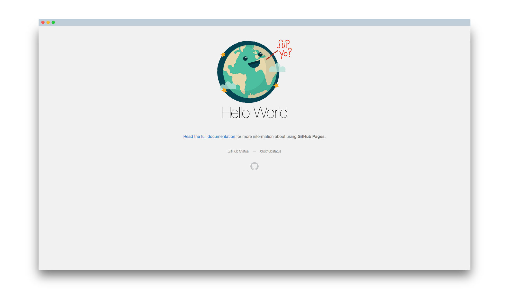

	

# Hello World

A simple GitHub Pages project

## Author

[@jaechow](https://github.com/jaechow)

## Demo Site

The live demo site is [here](https://jaechow.github.io/)

## Tools

- [Getting started with GitHub pages](https://docs.github.com/en/pages/getting-started-with-github-pages/creating-a-github-pages-site)
- [Base64 Image Encoder](https://www.base64encode.net/base64-image-encoder)
- [Screely](https://www.screely.com/)
